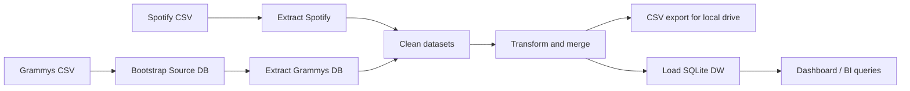

# Workshop 2: Spotify + Grammy ETL with Apache Airflow

This repository implements the workshop described in `ETL_Workshop-2.pdf`: extract Spotify data from CSV, extract Grammys data from a database, clean and merge both datasets, export the enriched dataset as CSV, load it into a data warehouse, orchestrate the process with Apache Airflow, and visualize insights from the warehouse.

## Project overview

- **Source 1**: `spotify_dataset.csv` (CSV)
- **Source 2**: `the_grammy_awards.csv` loaded into a SQLite source database
- **Transformation goal**: enrich Spotify tracks with Grammy track-level matches and artist-level Grammy history
- **Local "Google Drive" export**: `data/exports/google_drive/spotify_grammy_enriched.csv`
- **Data warehouse**: `data/warehouse/spotify_grammy_dw.sqlite`
- **Dashboard**: `dashboard/app.py`
- **Airflow DAG**: `dags/spotify_grammy_etl.py`

## Architecture

Detailed notes live in [docs/architecture.md](/Users/andresfelipecastrosalazar/Desktop/UAO/ETL/etl-workshop-2/docs/architecture.md).

High-level flow:



## Data model

The warehouse grain is **one row per unique Spotify track** in `fact_track_performance`.

Entities:

- `dim_track`: descriptive track data
- `dim_artist`: primary artist and artist-level Grammy history
- `dim_genre`: Spotify genre
- `dim_award`: Grammy award metadata
- `bridge_track_genre`: preserves every genre assigned to the same Spotify track
- `bridge_track_award`: exact track-to-award matches
- `fact_track_performance`: Spotify measures and Grammy enrichment flags

Main measures:

- `popularity`
- `duration_ms`
- `danceability`
- `energy`
- `speechiness`
- `acousticness`
- `instrumentalness`
- `liveness`
- `valence`
- `tempo`
- `track_grammy_win_count`
- `artist_grammy_win_count`

## Assumptions and transformation decisions

- The Spotify file contains a blank leading index column; it is renamed to `source_row_id` and removed from the business logic.
- `track_id` is treated as the canonical track identifier.
- Repeated `track_id` values in Spotify do not indicate different songs; profiling showed they overwhelmingly represent the same song repeated across multiple genres.
- Because of that, the model keeps one canonical row per `track_id` in the fact table and preserves all genres in `bridge_track_genre`.
- Exact duplicate Spotify rows are removed, while multi-genre duplicates are collapsed into a canonical track plus genre bridge records.
- When Spotify duplicates disagree on popularity, the canonical popularity uses the most frequent observed value and falls back to the highest value only when there is a tie. The warehouse also stores `popularity_min`, `popularity_max`, and a conflict flag for traceability.
- Grammys are loaded first into a **SQLite source database**, so Airflow extracts them from a database as requested by the workshop.
- The Grammy dataset behaves like a winners history because every observed `winner` value is `True`.
- The strongest deterministic merge is an **exact normalized match on primary artist + track/nominee name**.
- If a track does not match a Grammy nominee exactly but its primary artist exists in the Grammys history, the pipeline still enriches the track with artist-level Grammy stats through `track_match_type = artist_only`.
- The “Google Drive” delivery is implemented as a local export folder. You can point `LOCAL_DRIVE_EXPORT_DIR` to a synced Google Drive directory if needed.

## Repository structure

```text
.
├── dags/
├── dashboard/
├── docs/
├── reports/
├── scripts/
├── sql/
└── src/etl/
```

## How to run locally

1. Install dependencies:

```bash
python3 -m pip install -r requirements.txt
```

2. Make sure the source files are either:
   - in `data/raw/spotify_dataset.csv` and `data/raw/the_grammy_awards.csv`, or
   - still in `~/Downloads/spotify_dataset.csv` and `~/Downloads/the_grammy_awards.csv`

3. Run the ETL pipeline:

```bash
/usr/local/bin/python3 scripts/run_pipeline.py
```

4. Generate the profiling report:

```bash
/usr/local/bin/python3 scripts/run_data_profiling.py
```

5. Run the dashboard:

```bash
streamlit run dashboard/app.py
```

## Airflow usage

After installing Airflow, place this repository where Airflow can read the DAG and run:

```bash
airflow db init
airflow standalone
```

Then trigger the DAG `spotify_grammy_etl`.

Task order in the DAG:

1. `bootstrap_grammy_source_db`
2. `extract_spotify_csv`
3. `extract_grammy_db`
4. `clean_datasets`
5. `transform_and_merge`
6. `export_csv_to_local_drive`
7. `load_data_warehouse`

## Deliverables covered

- ETL pipeline code
- Airflow DAG
- Data warehouse schema
- Dashboard code
- Documentation of assumptions and design
- Profiling report generation
