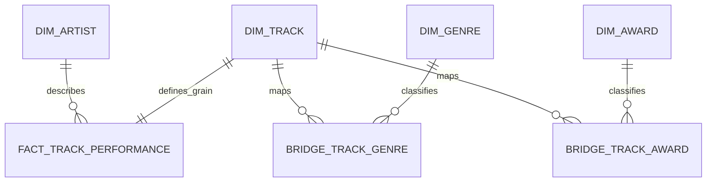

# Notas de arquitectura y diseño

## Alineación con el workshop

La implementación sigue el enunciado del PDF:

- Spotify se extrae desde CSV usando Python y Airflow.
- Grammys se carga primero a una base de datos fuente y luego Airflow lo extrae desde esa base.
- Ambas fuentes se limpian, normalizan y se integran.
- El dataset enriquecido se exporta a CSV y luego se carga al Data Warehouse.
- El dashboard consulta únicamente el warehouse.

## Diseño por etapas

### 1. Preparación de la fuente

- `scripts/bootstrap_grammy_source_db.py`
- Carga `the_grammy_awards.csv` a una tabla SQLite llamada `grammy_awards`

### 2. Extracción

- `extract_spotify_task()`
- `extract_grammy_task()`
- Ambas tareas guardan sus extracciones raw en `data/staging/`

### 3. Cleaning

Spotify:

- elimina filas inválidas sin `track_id` o `track_name`
- normaliza booleanos y campos numéricos
- crea `primary_artist`
- crea llaves normalizadas para joins
- consolida `track_id` repetidos en un track canónico
- preserva todos los géneros observados mediante diseño con tabla puente
- guarda metadata de conflicto cuando la popularidad difiere entre filas duplicadas

Grammys:

- normaliza `year` y `winner`
- crea llaves normalizadas de `artist` y `nominee`
- conserva el histórico completo de premios para análisis posteriores

### 4. Transformación

- match exacto: `primary_artist + track_name` normalizados contra `artist + nominee`
- fallback a nivel artista: historial Grammy agregado por artista
- campos derivados:
  - `duration_minutes`
  - `popularity_bucket`
  - `energy_to_acoustic_ratio`
  - `track_match_type`

### 5. Carga

- export local del CSV final
- Data Warehouse SQLite con:
  - dimensiones: artista, género, track, premio
  - fact: performance del track
  - bridge: track a género
  - bridge: track a premio

## Modelo dimensional

### Grano

El grano del modelo es **una fila por track único de Spotify** en `fact_track_performance`.

### Entidades

- `dim_track`
- `dim_artist`
- `dim_genre`
- `dim_award`

### Medidas

- `popularity`
- `popularity_min`
- `popularity_max`
- `duration_ms`
- `duration_minutes`
- `danceability`
- `energy`
- `speechiness`
- `acousticness`
- `instrumentalness`
- `liveness`
- `valence`
- `tempo`
- `track_grammy_win_count`
- `artist_grammy_win_count`
- `energy_to_acoustic_ratio`

### Relaciones

- `fact_track_performance.artist_key -> dim_artist.artist_key`
- `fact_track_performance.track_key -> dim_track.track_key`
- `bridge_track_genre.track_key -> dim_track.track_key`
- `bridge_track_genre.genre_key -> dim_genre.genre_key`
- `bridge_track_award.track_key -> dim_track.track_key`
- `bridge_track_award.award_key -> dim_award.award_key`

## Star schema propuesto

## Justificación del star schema

- Se usa un esquema estrella porque el objetivo principal del warehouse es soportar consultas analíticas y dashboards.
- El fact table queda en grano track para evitar duplicar medidas numéricas del mismo track.
- `genre` y `award` no se ponen como claves simples dentro del fact porque un track puede tener múltiples géneros y múltiples premios asociados.
- Por eso el diseño usa `bridge_track_genre` y `bridge_track_award`: mantienen el detalle analítico sin romper la granularidad del fact.
- Este diseño permite responder preguntas por artista, género, categoría y año sin sesgar promedios o conteos al repetir filas de performance.

Puedes ver una versión visual dedicada del modelo en `docs/star_schema_diagram.html`.

## Por qué SQLite

SQLite fue elegido tanto para la base fuente como para el warehouse porque:

- mantiene el workshop portable
- evita infraestructura externa durante evaluación
- sigue siendo una base relacional real para SQL, views y consultas del dashboard

Si luego necesitas una configuración más pesada, la misma lógica puede migrarse a PostgreSQL o MySQL con cambios acotados en la capa de carga.
